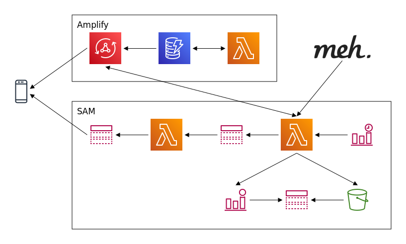

# Adequate-Backend



GraphQL backend for [Adequate](https://github.com/mgacy/Adequate), a free and open-source iOS client for the [Meh](https://meh.com) daily deal website.

## Getting Started

### Dependencies

- Create a free account on Meh and obtain an [API Key](https://meh.com/developers-developers-developers)

- [AWS Account](https://aws.amazon.com/mobile/details) with appropriate permissions to create the related resources

- [NodeJS](https://nodejs.org/en/download/) with [NPM](https://docs.npmjs.com/getting-started/installing-node)

- [AWS CLI](https://docs.aws.amazon.com/cli/latest/userguide/install-cliv2.html) with output configured as JSON

- [AWS Amplify CLI](https://github.com/aws-amplify/amplify-cli) configured for a region where [AWS AppSync](https://docs.aws.amazon.com/general/latest/gr/rande.html) and all other services in use are available `(npm install -g @aws-amplify/cli)`

- [AWS SAM CLI](https://github.com/aws/aws-sam-cli) `(brew tap aws/tap && brew install aws-sam-cli)`

- [Install jq](https://stedolan.github.io/jq/) `(brew install jq)`

### Deploy

1. Clone project

   ```bash
   git clone https://github.com/mgacy/Adequate-Backend.git
   cd Adequate-Backend
   ```

2. Initialize Amplify project:

   ```bash
   amplify init
   ```

3. Deploy Amplify app:

   ```bash
   amplify push
   ```

4. Install SAM dependencies:

   ```bash
   make init
   ```

5. Add Meh API Key as the value for `PLAIN_API_KEY` in `.env`, which will have been created during step (4). Optionally, to receive an email notification of any `deal_check` lambda errors, uncomment `ALARM_EMAIL` in `.env` and set that address as its value.

6. Deploy SAM app:

   ```bash
   make deploy
   ```
### Configure Notifications (Optional)

1. Clone client (it is expected that the client is located alongside `Adequate-Backend`):

   ```bash
   cd ..
   git clone https://github.com/mgacy/Adequate.git
   cd Adequate
   ```

2. Install [client dependencies](https://github.com/mgacy/adequate#3-install-tools-and-dependencies)

3. Generate push notification profiles with [Fastlane](https://docs.fastlane.tools/actions/pem/):

   ```bash
   fastlane pem -a your.organization.Adequate -u username [-p <password for p12 file>]
   fastlane pem -a your.Organization.Adequate -u username --development [-p <password for p12 file>]
   ```

3. Create SNS Platform application:

   ```bash
   make notifications
   ```

### Configure `dev` Environment (Optional)

If you forked this project, you can configure a development environment as follows:

1. Ensure all changes have been pushed to Amplify and the SAM app

2. Setup a `dev` environment:

   ```bash
   $ amplify env add
   ? Do you want to use an existing environment? No
   ? Enter a name for the environment dev
   ```

3. Push new Amplify environment:

   ```bash
   amplify push
   ```

4. Push corresponding SAM app:

   ```bash
   make deploy
   ```

5. Create `dev` branch in Git:

   ```bash
   $ git add .
   $ git commit -m "Creation of a dev amplify environment"
   $ git push -u origin master
   $ git checkout -b dev
   $ git push -u origin dev
   ```

## Roadmap

- Eliminate use of Amplify CLI
